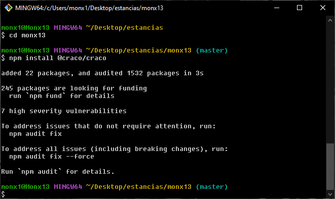
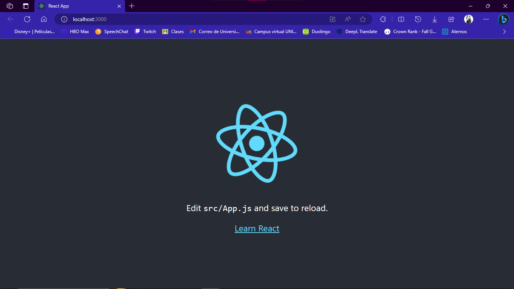
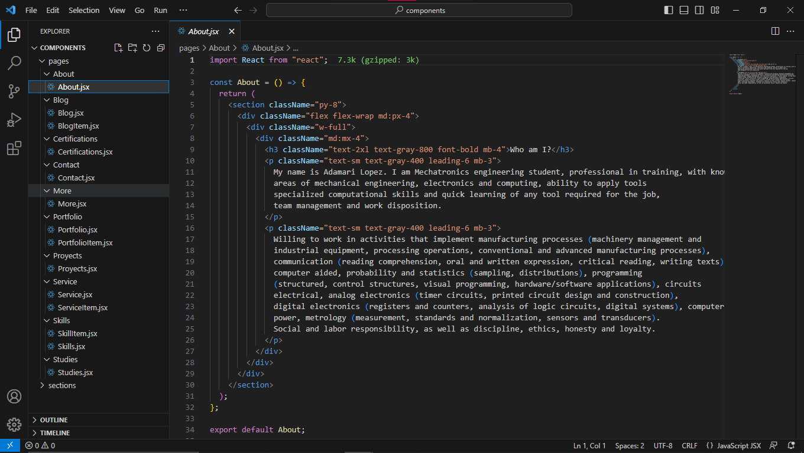

# *Daily Report Aug/31/2023*
 
- [*Daily Report Aug/31/2023*]
  - [**STATUS**](#status)
  - [**BLOCKERS**](#blockers)
  - [**ANNEXES**](#notes)
---

## **STATUS**
- I have made modifications to my template.

- Create a new project. I hope it works even if you have to install many libraries.

- In case it doesn't work I'll look for another template to edit.

- I added new sections in the components.

[Monx13 Portfolio](https://github.com/Monx13/monx13)

## **BLOCKERS**
- Due to the rain, the electricity was intermittent, so it can't go any further.

## **ANNEXES**
Some captures.

*Image 1. Install CRACO*

*Image 2. New proyect create with react*

*Image 3. Portfolio advances*

