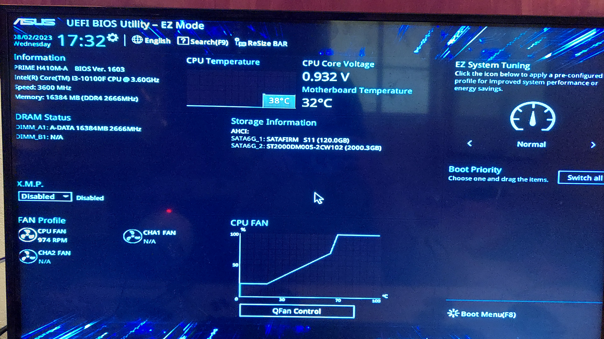

# *Daily Report Aug/02/2023*

---
 
- [*Daily Report Aug/02/2023*](#daily-report-aug022023)
  - [**STATUS**](#status)
  - [**BLOCKERS**](#blockers)
---

## **STATUS**

- Today I had a problem that does not let me continue with my activities.
  
- I was finishing my daily report for August 1st and my PC started to freeze.  I couldn't save and upload my daily report progress.

- I wrote this daily report from an editor that I installed on my cell phone to be able to update what was happening with my PC.

- My goal today was to do the fullstack bootcamp course exercises and start watching video 5.
---

## **BLOCKERS**

- When i was working my pc started to freeze screen.  I turned it off but when I turn it on it displays a screen where it shows that the temperature is not adequate and that perhaps some fans are not working properly.  The menu shows me options but won't let me make changes.  They are helping me to fix this problem.  I hope that by tomorrow I can continue with my activities and my computer does not have something serious.

---