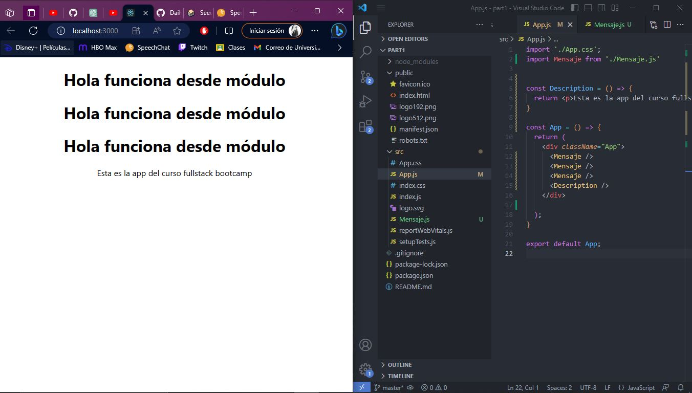
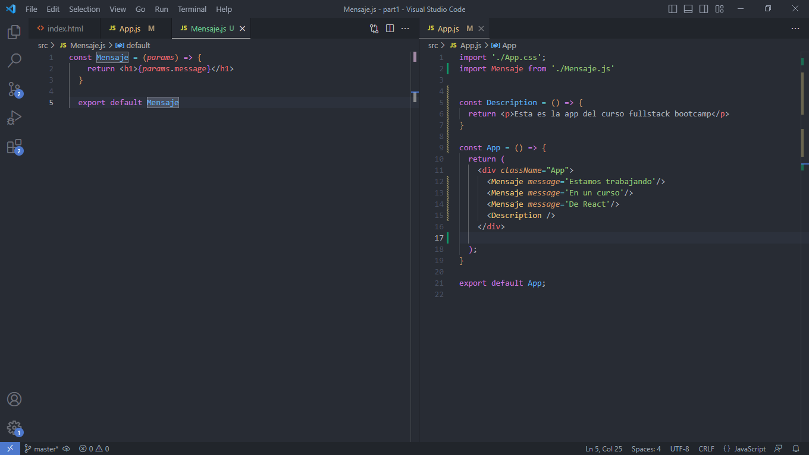
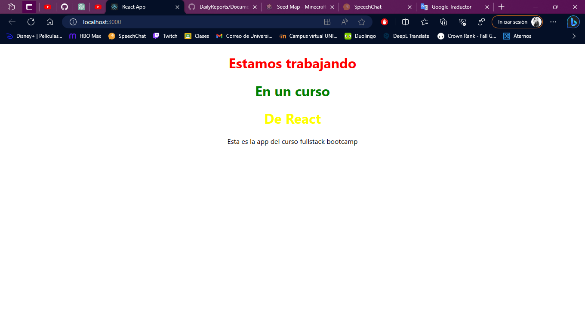
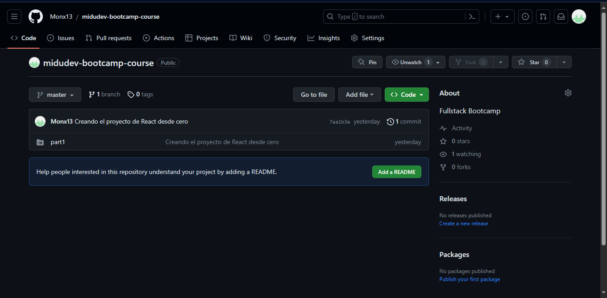

# *Daily Report Jul/27/2023*

## **STATUS**
- I keep learning things about the markdown technique, I can export images.
[Daily Reports](https://github.com/Monx13/DailyReports)

- I hope to start watching video 3 of the Bootcamp course. This video covers component state, conditional rendering, and events.
[Fullstack Bootcamp course](https://www.youtube.com/playlist?list=PLV8x_i1fqBw0Kn_fBIZTa3wS_VZAqddX7)

## **BLOCKERS**
- Sometimes he explains or writes the code very quickly, I have to pause and return the video to observe the corresponding changes and be able to use them in my code.

- My image could not be linked to the code to supplement my daily report.

- There was a problem uploading the progress to the repository because when building the project with npx it was built with the integrated repository, files had to be moved and some others removed. This problem is seen in midudev's video.

- Since it was created with .git it was uploaded as a submodule. That complicated how to upload the repository.

- When it was deleting and changing files, I was confused and maybe wrong files were deleted or changed.
  
- I'll have to create a new project from scratch, add the new files and edit the files as advanced.

## **NOTES**
Notes for markdown:

1. **Headers:**
    - Use the `#` symbol at the beginning of a line to create headers. The more pads you place, the lower the header level will be.
    ```markdown
    # Level 1 header
    ## Level 2 header
    ### Level 3 Header
    ```

2. **Text in bold and italics:**
    - Use `**text**` to make text bold and `*text*` or `_text_` to make it italic.
    ``` markdown
    **Bold text**
    *Text in italics*
    ```

3. **Lists:**
    - To create unordered lists, use `-` or `*` at the beginning of each line.
    ```markdown
    - Element 1
    - Element 2
    - Element 3
    ```
    - To create ordered lists, use numbers followed by a period.
    ```markdown
    1. First element
    2. Second element
    3. Third element
    ```

4. **Links and images:**
    - To link text to a URL, use `[Link Text](URL)`.
    ```markdown
    [Visit Google](https://www.google.com)
    ```
    - To insert images, use ``.
    ```markdown
    
    ```

5. **Quotes:**
    - To create quotes, use the `>` symbol before the text you want to quote.
    ```markdown
    > This is a quote.
    ```

6. **Inline code and code blocks:**
    - To highlight inline code, use single quotes or back quotes.
    ```markdown
    `print("Hello world")`
    ```
    - For code blocks, place three backslashes before and after the code. You can specify the language to get syntax highlighting.
    ```
    ```python
    def greeting():
        print("Hello world")
    ```
    ```

7. **Horizontal lines:**
    - To insert a horizontal line, use three or more hyphens `-`, asterisks `*`, or underscores `_` on a separate line.
    ```markdown
    ---
    ```

8. **Tables:**
    - To create tables, use `|` to separate the columns and `-` to separate the table header from the table of contents.
    ```markdown
    | Name | Age |
    |------|-----|
    | John |  25 |
    | Mary |  30 |
    ```

## **ANNEXES**
Some captures of what was worked on in video 2.


*Image 1. Use of modules.*


*Image 2. Use of props or parameters.*


*Image 3. Preview*


*Image 4. Progress uploaded as a submodule, beginning of the problem.*