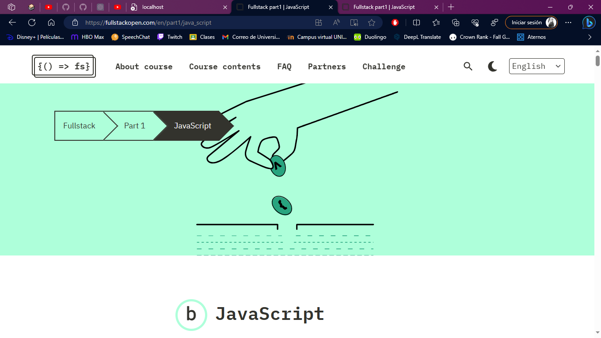
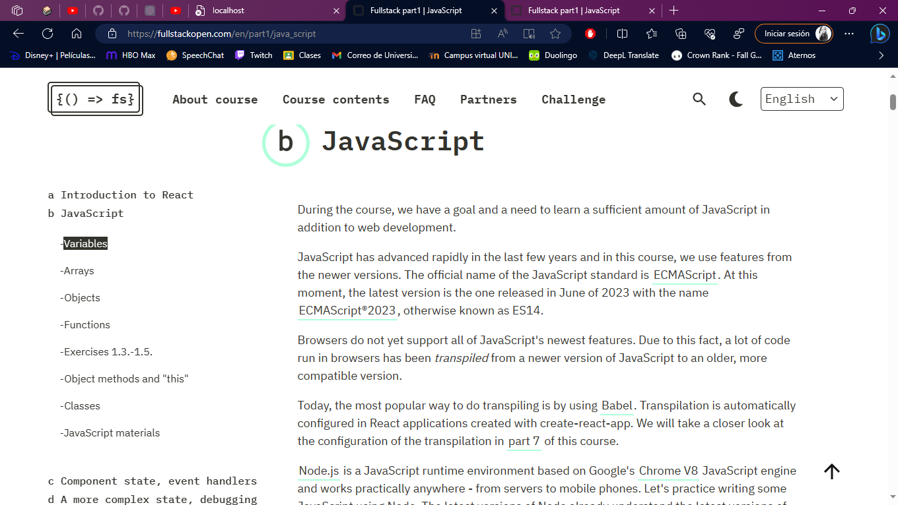
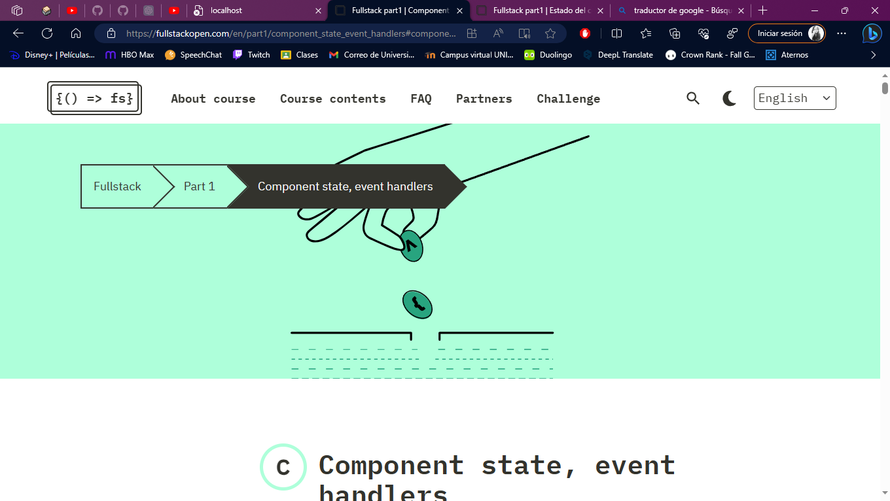
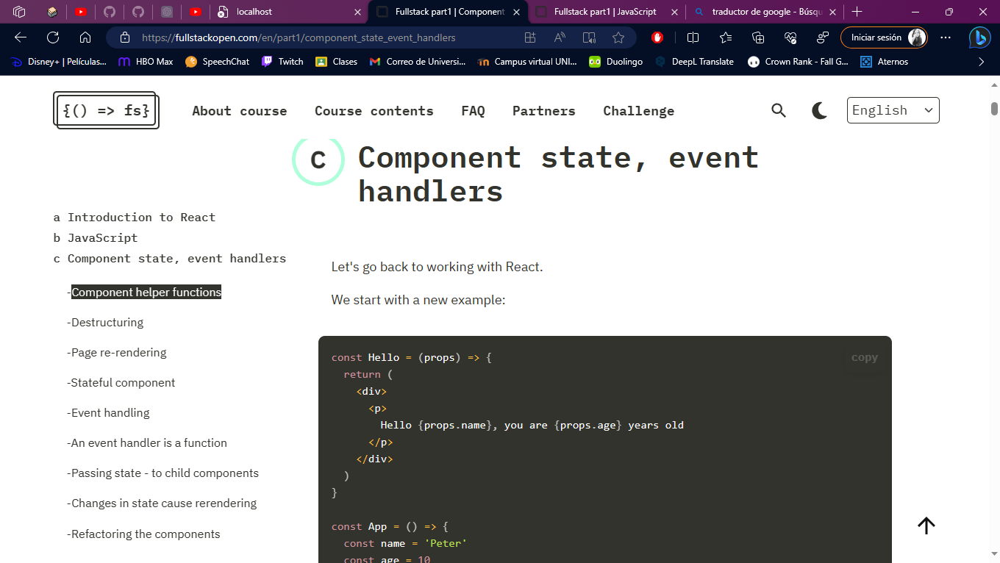

# *Daily Report Jul/31/2023*

---
 
- [*Daily Report Jul/31/2023*](#daily-report-jul312023)
  - [**STATUS**](#status)
  - [**BLOCKERS**](#blockers)
  - [**NOTES**](#notes)
    - [\* *JavaScript* \*](#-javascript-)
    - [\* *Variables* \*](#-variables-)
    - [\* *Arrays* \*](#-arrays-)
    - [\* *Objects* \*](#-objects-)
    - [\* *Functions* \*](#-functions-)
    - [\* *Stateful component* \*](#-stateful-component-)
    - [\* *Event handling* \*](#-event-handling-)
  - [**ANNEXES**](#annexes)
---


## **STATUS**

- I'm finishing video 3 "React ⚛️: Component State, Conditional Rendering, and Events" for the FullStack Bootcamp course. 
[Fullstack Bootcamp Youtube](https://www.youtube.com/playlist?list=PLV8x_i1fqBw0Kn_fBIZTa3wS_VZAqddX7)
  
- Concepts and examples of javascript fundamentals, arrays, functions, component state, event handlers are being seen.

- I made the changes according to the progress I already had, and uploaded the new commit to the repository.
[Fullstack Bootcamp Repository](https://github.com/Monx13/midudev-bootcamp-course)

- Today's preview is expected to start with video 4 of the Fullstack Bootcamp course.

[Fullstack Bootcamp Course](https://fullstackopen.com/es/)

---

## **BLOCKERS**

- None
---

## **NOTES**

### * *JavaScript* *

During the course, we have a goal and a need to learn a sufficient amount of JavaScript in addition to web development.

Browsers do not yet support all of JavaScript's newest features. Due to this fact, a lot of code run in browsers has been transpiled from a newer version of JavaScript to an older, more compatible version.

Node.js is a JavaScript runtime environment based on Google's Chrome V8 JavaScript engine and works practically anywhere - from servers to mobile phones. Let's practice writing some JavaScript using Node. The latest versions of Node already understand the latest versions of JavaScript, so the code does not need to be transpiled.

The code is written into files ending with .js that are run by issuing the command node name_of_file.js

It is also possible to write JavaScript code into the Node.js console, which is opened by typing node in the command line, as well as into the browser's developer tool console. The newest revisions of Chrome handle the newer features of JavaScript pretty well without transpiling the code. Alternatively, you can use a tool like JS Bin.

### * *Variables* *

In JavaScript there are a few ways to go about defining variables:

```js
const x = 1
let y = 5

console.log(x, y)   // 1, 5 are printed
y += 10
console.log(x, y)   // 1, 15 are printed
y = 'sometext'
console.log(x, y)   // 1, sometext are printed
x = 4               // causes an error
```

### * *Arrays* *

An array and a couple of examples of its use:

```js
const t = [1, -1, 3]

t.push(5)

console.log(t.length) // 4 is printed
console.log(t[1])     // -1 is printed

t.forEach(value => {
  console.log(value)  // numbers 1, -1, 3, 5 are printed, each to own line
})                    
```
Notable in this example is the fact that the contents of the array can be modified even though it is defined as a const. Because the array is an object, the variable always points to the same object.

One way of iterating through the items of the array is using forEach as seen in the example. *forEach* receives a function defined using the arrow syntax as a parameter.

*forEach* calls the function for each of the items in the array, always passing the individual item as an argument. The function as the argument of *forEach* may also receive other arguments.

``` js
const t = [1, -1, 3]

const t2 = t.concat(5)  // creates new array

console.log(t)  // [1, -1, 3] is printed
console.log(t2) // [1, -1, 3, 5] is printed
```

The method call t.concat(5) does not add a new item to the old array but returns a new array which, besides containing the items of the old array, also contains the new item.

```js
const t = [1, 2, 3] 

const m1 = t.map(value => value * 2) 
console.log(m1) // [2, 4, 6] es impreso
```

*map* creates a new array, for which the function given as a parameter is used to create the items. In the case of this example, the original value is multiplied by two.


### * *Objects* *

There are a few different ways of defining objects in JavaScript. One very common method is using object literals, which happens by listing its properties within braces:


```js
const object1 = {
  name: 'Arto Hellas',
  age: 35,
  education: 'PhD',
}

const object2 = {
  name: 'Full Stack web application development',
  level: 'intermediate studies',
  size: 5,
}

const object3 = {
  name: {
    first: 'Dan',
    last: 'Abramov',
  },
  grades: [2, 3, 5, 3],
  department: 'Stanford University',
}
```
The values of the properties can be of any type, like integers, strings, arrays, objects...

The properties of an object are referenced by using the "dot" notation, or by using brackets:

```js
console.log(object1.name)         // se imprime Arto Hellas
const fieldName = 'age' 
console.log(object1[fieldName])    // 35 es impreso
```
You can also add properties to an object on the fly by either using dot notation or brackets:

```js
object1.address = 'Helsinki'
object1['secret number'] = 12341
```
The latter of the additions has to be done by using brackets because when using dot notation, secret number is not a valid property name because of the space character.

### * *Functions* *

Of defining an arrow function is as follows:

```js
const sum = (p1, p2) => {
  console.log(p1)
  console.log(p2)
  return p1 + p2
}
```

This form is particularly handy when manipulating arrays - e.g. when using the map method:

```js
const t = [1, 2, 3]
const tSquared = t.map(p => p * p)
// tSquared is now [1, 4, 9]
```

There are two ways to reference the function; one is giving a name in a function declaration.

```js
function product(a, b) {
  return a * b
}

const result = product(2, 6)
// result is now 12
```
he other way to define the function is by using a function expression. In this case, there is no need to give the function a name and the definition may reside among the rest of the code:

```js
const average = function(a, b) {
  return (a + b) / 2
}

const result = average(2, 5)
// result is now 3.5
```

### * *Stateful component* *

```js
import { useState } from 'react'

const App = () => {

  const [ counter, setCounter ] = useState(0)


  setTimeout(
    () => setCounter(counter + 1),
    1000
  )

  return (
    <div>{counter}</div>
  )
}

export default App
```
The function call adds state to the component and renders it initialized with the value of zero. The function returns an array that contains two items. We assign the items to the variables counter and setCounter by using the destructuring assignment syntax shown earlier.

The counter variable is assigned the initial value of state which is zero. The variable setCounter is assigned a function that will be used to modify the state.

The application calls the setTimeout function and passes it two parameters: a function to increment the counter state and a timeout of one second:
```js
setTimeout(
  () => setCounter(counter + 1),
  1000
)
```
The function passed as the first parameter to the setTimeout function is invoked one second after calling the setTimeout function.
```js
() => setCounter(counter + 1)
```
When the state modifying function setCounter is called, React re-renders the component which means that the function body of the component function gets re-executed:
```js
() => {
  const [ counter, setCounter ] = useState(0)

  setTimeout(
    () => setCounter(counter + 1),
    1000
  )

  return (
    <div>{counter}</div>
  )
}
```

### * *Event handling* *

Button elements support so-called mouse events, of which click is the most common event. The click event on a button can also be triggered with the keyboard or a touch screen despite the name mouse event.

In React, registering an event handler function to the click event happens like this:
```js
const App = () => {
  const [ counter, setCounter ] = useState(0)


  const handleClick = () => {
    console.log('clicked')
  }

  return (
    <div>
      <div>{counter}</div>

      <button onClick={handleClick}>
        plus
      </button>
    </div>
  )
}
```

We set the value of the button's onClick attribute to be a reference to the handleClick function defined in the code.

Now every click of the plus button causes the handleClick function to be called, meaning that every click event will log a clicked message to the browser console.

The event handler function can also be defined directly in the value assignment of the onClick-attribute:

```js
const App = () => {
  const [ counter, setCounter ] = useState(0)

  return (
    <div>
      <div>{counter}</div>

      <button onClick={() => console.log('clicked')}>
        plus
      </button>
    </div>
  )
}
```
By changing the event handler to the following form
```js
<button onClick={() => setCounter(counter + 1)}>
  plus
</button>
```
we achieve the desired behavior, meaning that the value of counter is increased by one and the component gets re-rendered.

Let's also add a button for resetting the counter:
```js
const App = () => {
  const [ counter, setCounter ] = useState(0)

  return (
    <div>
      <div>{counter}</div>
      <button onClick={() => setCounter(counter + 1)}>
        plus
      </button>

      <button onClick={() => setCounter(0)}> 
        zero
      </button>
    </div>
  )
}
```
---
## **ANNEXES**
Some captures of what was worked on in video 3.







