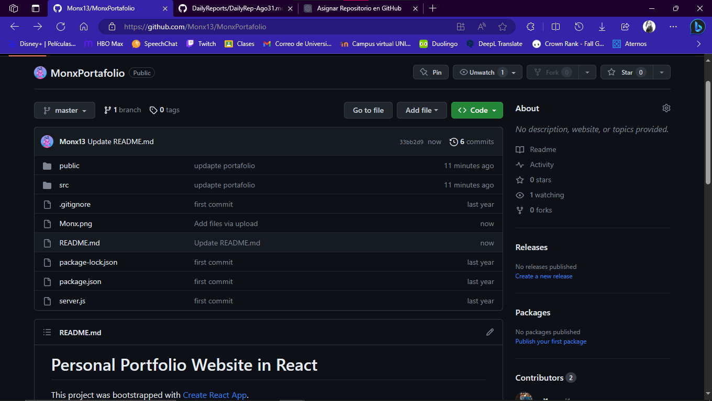

# *Daily Report Sep/01/2023*
 
- [*Daily Report Sep/01/2023*]
  - [**STATUS**](#status)
  - [**BLOCKERS**](#blockers)
  - [**NOTES**](#notes)
  - [**ANNEXES**](#annexes)
---

## **STATUS**
- I searched for a new template and cloned it on my computer.

- I searched for a new template to edit. I tried if I could display it first on my local host and checking this step I started to edit my template.

- I started to edit the home in texts and background images.

- I am learning and knowing each section and component of the template to know where to edit and add components.

- I uploaded the new changes of my project on github. I created a new repository again but now I can upload it to the remote with no problem.

[Monx13 Portfolio](https://github.com/Monx13/MonxPortafolio)


## **BLOCKERS**
- Due to the rain, the electricity was intermittent, so it can't go any further.

## **NOTES**

### **Clone a repository**
Cloning a repository is the process of copying an existing Git repository from a remote server (such as GitHub, GitLab, Bitbucket, etc.) to your local machine so that you can work on it. To clone a repository, follow these steps:

1. **Get the repository URL:** Go to the repository page on the hosting service (eg GitHub) and copy the repository URL. The URL is usually in the format `https://github.com/user/repository-name.git` or `git@github.com:user/repository-name.git`.

2. **Open your terminal:** Open the terminal or command line in your operating system.

3. **Navigate to the directory where you want to clone the repository:** Use the `cd` command to navigate to the folder on your local machine where you want the repository to be cloned. For example:

```bash
cd destination-directory
```

4. **Clone the repository:** Use the `git clone` command followed by the URL of the repository you copied in step 1. For example:

```bash
git clone https://github.com/user/repository-name.git
```

If you are using SSH to authenticate, you can use the SSH URL:

```bash
git clone git@github.com:user/repository-name.git
```

5. **Enter your credentials (if required):** If the repository is private and requires authentication, Git will ask for your credentials (username and password or SSH key) to access the repository.

6. **Wait for cloning to complete:** Git will start cloning the repository to your local machine. Once it's done, you'll have a full copy of the repository in your destination directory.

After cloning the repository, you can work on it, create branches, make changes, and commit locally. If you want to sync your changes with the remote repository, you can use the `git push` commands to push your changes and `git pull` to pull changes from the remote repository.

For example, to submit changes:

```bash
git add .
git commit -m "Description of change"
git push origin name-of-your-branch
```

And to get changes from the remote repository:

```bash
git pull origin name-of-your-branch
```

Remember to replace "name-of-your-branch" with the name of the branch you are working on.

### **error: remote origin already exists**
The error message "error: remote origin already exists" means that Git already has a reference to a remote repository named "origin" in your local configuration. This usually happens when you have previously configured a remote repository with the same name and are trying to add a new one with the same name.

To resolve this issue, you can do one of the following:

1. **Check current remote repository configuration:** Before adding a new remote repository, check which remote repository is currently configured in your project. You can use the following command to view the remote configuration:

    ```bash
    git remote -v
    ```

    This will display a list of remote repositories configured in your project. Make sure there isn't a remote repository with the name "origin" referring to the wrong repository.

2. **Change the name of the existing remote repository:** If you have an existing remote repository with the name "origin", you can change its name to something different to avoid conflicts. You can use the following command to change the name of the remote repository:

    ```bash
    git remote rename origin new_name
    ```

    Replace "new_name" with whatever name you want for the remote repository.

3. **Delete existing remote repository:** If you don't need the existing remote repository named "origin" and want to replace it with a new one, you can delete it with the following command:

    ```bash
    git remote remove origin
    ```

    Then you can add the new remote repository with the `git remote add` command as mentioned in the previous answer.

Remember that these actions should be done with caution, especially if you have important data in the existing remote repository. Be sure to back up or transfer any necessary data before deleting or changing the remote repository settings.

## **ANNEXES**
Some captures.


*Image 1. New Template to edit.*


*Image 2. Template edited in my style with my data*


*Image 3. New repository*


*Image 4. Portfolio of new repository*

